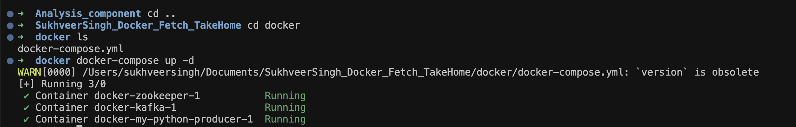
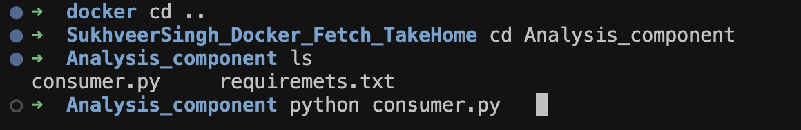
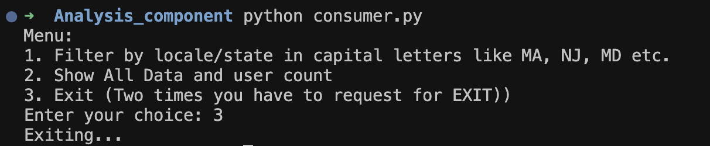
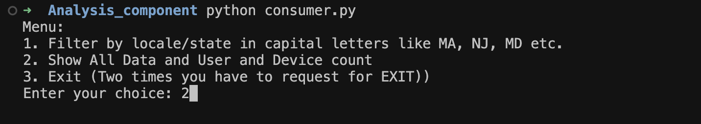
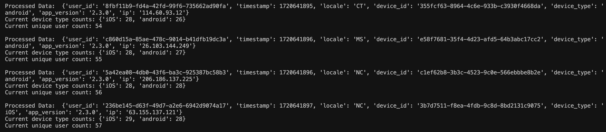
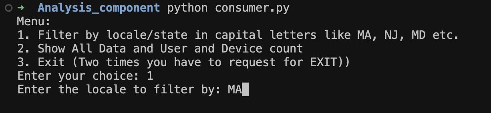
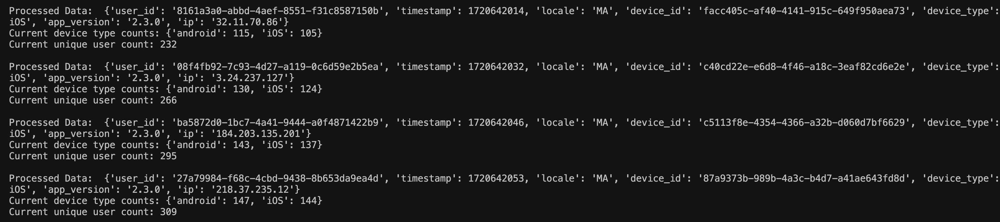
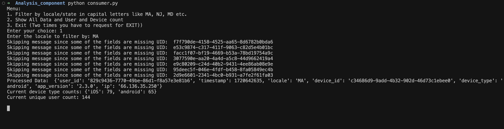

# SukhveerSingh_Docker_Fetch_TakeHome

## Setup Instructions

### Prerequisites
- Docker
- Docker Compose
- Python 3
- pip
### Otional step to create Virtual env 
- python -m venv venv
- source venv/bin/activate 

### Step-by-Step Setup
To install all dependencies go to the Analysis Component folder and run the requirements.txt file

Then go go to the docker folder to start the container in your local pc and access the Real time data

Then use the commands below, run consumer.py 

##The Outputs are as follows: 
### For Easy User experience

### For Agreegating and counts

## For Filtering the Data according to States (We can perform more operations)

## Explanations
## Design Choices:
I have used used Docker-Compose, and python programming language to communicate with the container provided.
for Error handling I have used the missing logs info, if yes it will show error in the output window like this: 

The issue I see is and resolved is with Device_type, that is why i used this parameter but we can perform further analysis and handle it better on all the parameters.

## Data Flow
- Data is generated and sent to the "user-login" Kafka topic.
- The Kafka consumer script processes this data and sends the results to the processed-user-login topic as requested in the question.
- The script analyzes device types and unique user counts.

### For Efficiency, Scalability and Fault Tolerance I have implemented:
- Continuous polling of Kafka ensures real-time processing which will Docker keeps everything running smoothly.
- Since, we are using kafka we can say that the application is very scalable, because we can add users anytime. 
- In fault tolerance the docker will restart the failed containers automatically, and we have implemented error handling in the logs above with UID to match. 

## Questions to answer: 
### How to deploy this app to production?
Ans: There are many cloud apps one I would suggest is to use Confluent cloud or AWS MSK these are very scalable and easy to setup with autoscaling with EC2.
To monitor I would prefer Grafana, and Dynatrace. 

## What other component should we add to make this production ready?
Ans: I can think of these points to make it production ready, there might be more:- 
- Logging with ELK stack.
- Security measures(SSL/TLS, authentication)
- CI/CD pipelines with Jenkins or GitHub Actions.
- Monitoring and alerting systems like Dynatrace or Grafana.

## How can this application scale with a growing dataset?
Ans: To scale this app with more load we can use:
- AWS EC2 for autoscaling and deploy on AWS cloud.
- Use Kafka’s partitioning to distribute load.
- Implement Kafka data compaction for efficient long-term storage.

